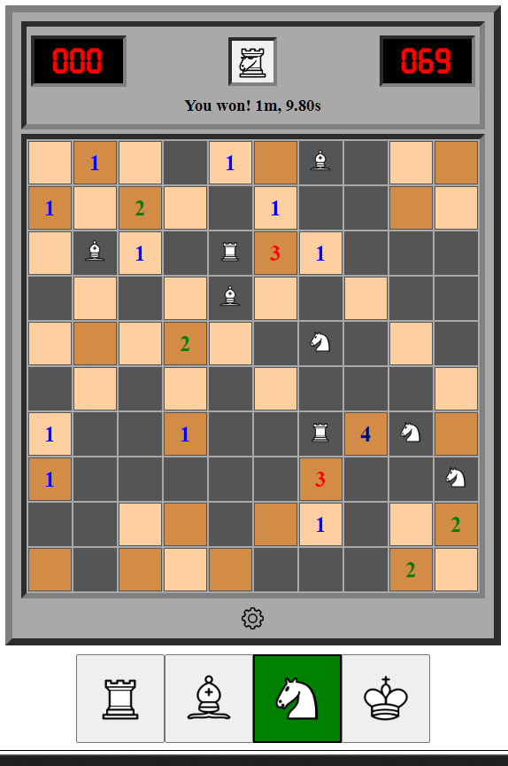

# Chessweeper &middot; 

Chess X Minesweeper - Numbered tiles represent the number of pieces that have that tile in check.

Play at https://chessweeper.com

## Development

To run the game locally with debug tools, run `npm install` to install dependencies, then run `npm run start`.

To run unit tests, run `npm run test`.

To build a release version of the game, run `npm run build`. The output is placed in the `build` directory.

### All NPM Commands

| Command    | Description                                                                            |
| ---------- | -------------------------------------------------------------------------------------- |
| `start`    | run dev server                                                                         |
| `preview`  | run output from local build directory (requires running build first)                   |
| `build`    | create production build in the `build` directory                                       |
| `test`     | run unit tests                                                                         |
| `coverage` | run unit tests and generate a coverage report                                          |
| `format`   | run prettier formatting on all files (husky does this on staged files before a commit) |
| `lint`     | check for eslint warnings/errors in all ts/tsx files                                   |
| `tsc`      | run typescript compiler to check for type errors in all ts/tsx files                   |
| `prepare`  | automatically run by NPM during install to setup husky                                 |

## Credits

- Chess icons and favicon from https://github.com/oakmac/chessboardjs
- Shovel icon from Vectors Market, Flaticon, https://www.flaticon.com/free-icons/shovel
- Shogi icons from Wikimedia Commons by Hari Seldon under Creative Commons Attribution-Share Alike 3.0 Unported
- Digital font from The FontStruction, https://fontstruct.com/fontstructions/show/583495, by jon889 under a Creative Commons Attribution Share Alike
- Idea taken from https://www.reddit.com/r/AnarchyChess/comments/ytw69b/new_chess_2_update_just_dropped_numbers_are_based/
